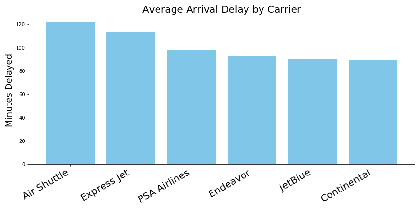
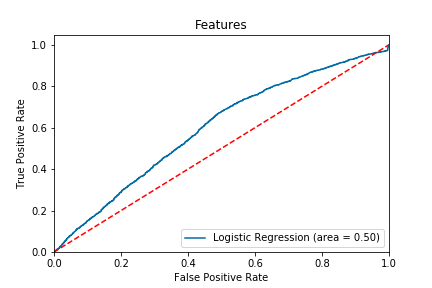

# Flight Delay Prediction for Boston Logan Airport 
# Anton Korolev
[LinkedIn](https://www.https://www.linkedin.com/in/anton-korolevb558/) | [GitHub](https://https://www.github.com/VHTATAH)
## Table of Contents
1. [Overview](#Overview)
2. [Data](#Data)
3. [Visualization of Dataset](#Visualization%20of%20Dataset)
4. [Logistic Regression](#Logistic%20Regression) 
5. [Random Forest](#Random%20Forest) 
6. [Gradient Boosting](#Gradient%20Boosting)
---
## Overview
**Federal Aviation Administration** estimated that flight delays cost the airline industry $8 billion a year, much of it due to increased spending on crews, fuel and maintenance. Delays cost passengers even more - nearly $17 billion.

In this project I used machine Learning techniques to predict flight arrival delays for Boston Logan Airport. Various prediction models were developed and evaluated. Data was visually represented using graphs and charts.

## Data
Since June 2003, the airlines that report on-time data also report the causes of delays and cancellations to the **Bureau of Transportation Statistics**. Reported causes of delay are available from June 2003 to the most recent month and can be downloaded from the official goverment website: https://www.transportation.gov/

## Visualization of Dataset 

## Logistic Regression

### Confusion Matrix:

### ROC Curve:

## Random Forest

### Confusion Matrix:

### ROC Curve:

### Gini Importance:

## Gradient Boosting 

### Confusion Matrix:

### ROC Curve:

